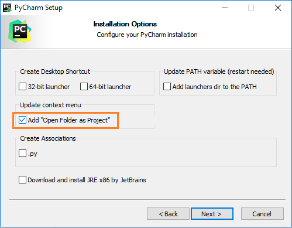
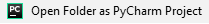

=========================================================
Documentation for ``basic_python`` package
=========================================================

This project,
`hosted on gitlab <https://gitlab.devtools.intel.com/python_training/basic_python.git>`_,
holds the training material required for the 'Basic Python' course
that is provided to Intel employees, through http://goto/saba.

It is a one day frontal workshop that walks you through
:download:`this presentation <_static/Basic Python - 2018.pptx>`
pausing at the end of each chapter - allowing you to perform the related
exercises provided by this project **on your Laptop**.

This course uses Industry Standard :abbr:`BKMs (Best Known Methods)`
for supporting your fast and efficient entry to the *python* world.
For that it introduces a simplified standard python package - that you get to
develop,
and exposes you to developing it from the *PyCharm*
:abbr:`IDE (Integrated Development Environment)` -
that continuously leverages latest and greatest python features,
increasing your efficiency from day one.

.. attention::
    this course teaches you *python* programming
    **on your Laptop, please avoid using remote machines for the duration of this course**.

For these reasons and more this course insists on fulfilling the specified
:ref:`prerequisites <PrerequisitesInstructions>` **in advance**.
Please consult your instructor on any concern.

.. contents::
    :local:
    :depth: 3

.. _PrerequisitesInstructions:

Prerequisites Instructions
=========================================================

The provided instructions assumes installation of this project under
``C:\Projects\basic-python`` for the sake of convenience.
Furthermore, verbal discussions during the frontal session with respect
to concrete project files may also assume this location for the sake of
simplicity (e.g. sharing absolute links though IM, e-mail, etc.).

Please consult your instructor **in advance** in case you have a good rational
for installing it elsewhere,
so that your use-case could be addressed in this documentation.

Python Install
----------------------------------------
Install *Python* from `<https://www.python.org>`_.

- Recommended version https://www.python.org/ftp/python/3.6.8/python-3.6.8-amd64.exe
- If you insist on python 2.7 then use https://www.python.org/ftp/python/2.7.13/python-2.7.13.amd64.msi

.. note::
    You can have multiple python versions installed

*GIT* Install
----------------------------------------

#. Search in a web browser for "git install" or try out https://git-scm.com/downloads.
#. Download the version matching your OS and run the installer.
   Accepting all the proposed options is generally a good choice.

.. note::
    *GIT* was selected as the repository for this project as both
    *SVN* and *TFS* are marked for :abbr:`EOL (End Of Life)` by IT,
    so you are most likely to encounter *GIT* in the near future.

*TortoiseGit* Install
+++++++++++++++++++++++++++

If you are going to develop with *GIT* repositories,
then you certainly should have *TortoiseGit* on your side.
If you are not sure then simply get it:-)

#. Download and install from
   https://tortoisegit.org/download/
#. Accept proceeding with the *First Start Wizard* and enter your details as
   appear in outlook, e.g.:

   .. image:: _static/Configure_user_information.png

Install Project in *Editable Mode*
----------------------------------------
.. attention::
    The following comfort links and proposed command-lines assume you are using
    the recommended version (3.6).
    If that is not the case than you should manually execute those commands
    while revising the preceding ``py -3.6`` by your interpreter of choice, e,g:

    - Replace it by ``py -2.7`` in order to explicitly use a python2.7 install.
    - Replace it by ``py`` in order to use the latest python version installed.
    - Replace it by ``python`` in order to use the version that added its path to
      the environment variables (and only if you know what this means...).

.. warning::
    The comfort links below may not work directly from your browser if you have
    just been using it for either a *Python* or a *GIT* install.
    If that is indeed the case then either **restart your browser**
    or download the linked batch files and manually execute
    from a new command line.

Install this project in 'editable mode' - by either using this
:download:`built-in script <_static/basic_python.bat>`, or by any of the
:ref:`alternative options <AlternativeEditableModeInstall>`.

To verify proper install of this package and its python dependencies please
:download:`execute this script <_static/install_self_test.bat>`.
You should see a command prompt opens with this text::

    1 1 2 3
    Press any key to continue . . .

If that is not the case then please start from self-reviewing your install
process and consult your instructor if needed.
**Do not leave this to be resolved during the frontal course**.

*PyCharm* Install
----------------------------------------
Install *PyCharm* from https://www.jetbrains.com/pycharm.
The `Educational Version <https://www.jetbrains.com/education/download/#section=pycharm-edu>`_
is free and highly recommended.

You should generally accept the proposed defaults, however it is recommended
to check the ``Add "Open Folder as Project"`` option when this dialog appears
for improved :abbr:`UX (User eXperience)`:

.. note::
      If you already have *PyCharm* installed then you can upgrade to the educational version simply by
      `installing the EduTools plugin <https://www.jetbrains.com/help/education/install-edutools-plugin.html?section=PyCharm>`_.
      However, this might not be accessible when connected through Intel's VPN.
      Please disconnect the VPN for installing the plugin and then reconnect.

Finally verify your overall readiness:

- Open your lately-installed project in *PyCharm*:
  from a file browser right-click the ``C:\Projects\basic-python`` folder and
  select the |Open_Folder_as_PyCharm_Project__Button| option.
  Alternatively open *PyCharm*, select the
  :menuselection:`File --> Open...` menu, provide the
  ``C:\Projects\basic-python`` and click ``OK``.
- Select the ``C:\Projects\basic-python\basic_python\fibo.py`` module,
  right-click inside its content and verify you get
  this sort of appearance:

  .. image:: _static/Open_Project_Verification.png

  Please consult your instructor if you are experiencing major differences.

  .. hint::
    During the course we are going to use the ``Run Doctest in <module>`` option
    illustrated above for verifying correct completion of assignments!

Congratulations, If you got this far than you're system is ready for making the
best of this course!!!
Feel free to explore this course's content through *PyCharm*.
You may also find the below :ref:`FrameworkReference`
useful as it adds another perspective of observing the same modules!

Framework reference
=========================================================
Here you get to look at the code samples that are used throughout this course
from a user's perspective.
You get a glimpse on how *sphinx* is used to auto-generate documentation of your
code with increased usefulness.

.. toctree::
    :maxdepth: 3
    :numbered:

    framework_ref/index

Appendices
=========================================================

.. _AlternativeEditableModeInstall:

Alternative editable-mode install method
-------------------------------------------
Install this project in 'editable mode' - by either:

* using this
  :download:`built-in script <_static/basic_python.bat>`.

* Imitating it from a *Windows* command line:

  .. code-block:: bash

    py -3.6 -m pip install -e git+https://gitlab.devtools.intel.com/python_training/basic_python.git#egg=basic_python --src C:\Projects

* Manual break-down from a *Windows* command line:

  .. code-block:: bash

    git clone https://gitlab.devtools.intel.com/python_training/basic_python.git C:\Projects\basic-python
    py -3.6 -m pip install -e C:\Projects\basic-python

* 'GIT-less':

  Fetching content from a *GitLab* repository does not strictly insist on using
  *GIT*, but rather makes it very easy for you if you do so.
  If you have a good rational for avoiding a *GIT* installation then you could
  use the below instructions,
  however please consult your instructor so that your use-case could be
  addressed in this documentation.

  #. Browse to the *GitLab* project at
     https://gitlab.devtools.intel.com/python_training/basic_python
  #. Click the *Download* button and select the ``Download zip`` option:

     .. image:: _static/manual_download.png

  #. Pick the ``Save File`` option and click ``OK``:

     .. image:: _static/save_basic_python-master-zip.png

  #. Locate the ``basic_python-master.zip`` file on your system and
     *Unzip to folder* ``C:\Projects``.
  #. Rename ``C:\Projects\basic_python-master``
     to ``C:\Projects\basic-python``.
  #. Browse to ``C:\Projects\basic-python`` and execute (*double click*) the
     ``_install_editable_mode.bat`` convenience script.
